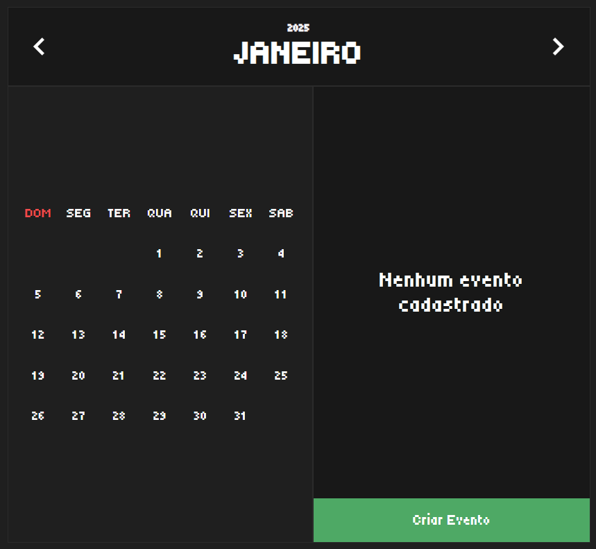
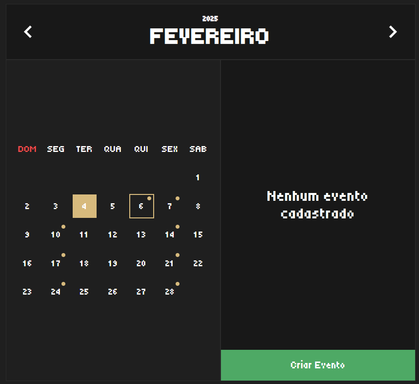
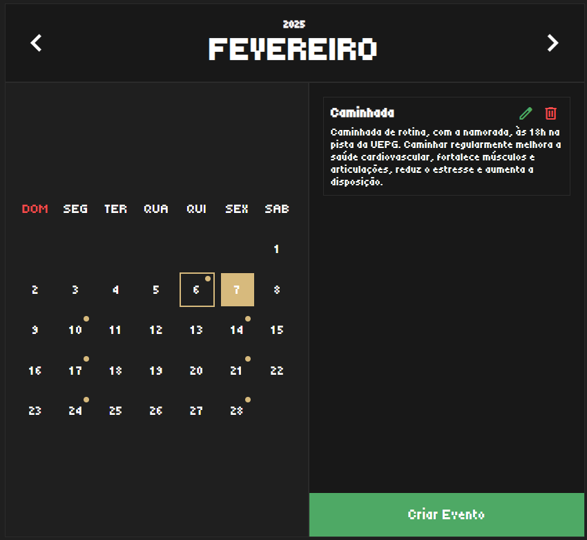

# 📅 Calendário de Eventos

Um calendário interativo para gerenciar eventos de forma simples e eficiente.
Criado com Spring Boot e ReactJS.

## 🖼️ Preview

### Janeiro de 2025 (sem eventos)


### Fevereiro de 2025 (com eventos marcados)


### Evento cadastrado


## 🚀 Funcionalidades

- 📆 **Navegação entre meses** através dos botões no cabeçalho.
- 🔍 **Visualização de eventos**: ao clicar em um dia, os eventos cadastrados serão exibidos.
- ✏️ **Edição e exclusão de eventos** diretamente na interface.
- ➕ **Criação de eventos** através do botão "Criar Evento".
- 🎨 **Destaques visuais**:
  - O dia **selecionado** é destacado com fundo amarelo pastel.
  - Os dias que possuem **eventos cadastrados** também aparecem com essa cor.
  - O dia **atual** também recebe um destaque especial.

## 🛠️ Tecnologias Utilizadas

- Backend: **Spring Boot**
- Frontend: **React**
- Estilização: **CSS personalizado com tema escuro**

## 📥 Instalação

1. Clone o repositório:
   ```sh
   git clone https://github.com/JoaoGSoek/Calendario-De-Eventos.git

2. Acesse a pasta do projeto:
	```sh
	cd Calendario-De-Eventos

3. Instale as dependências do frontend:
	```sh
	cd eventos_gui
	npm install

4. Inicie o frontend:
	```sh
	npm start

5. Inicie o backend:
	```sh
	cd ../eventos_api
	./mvnw spring-boot:run


